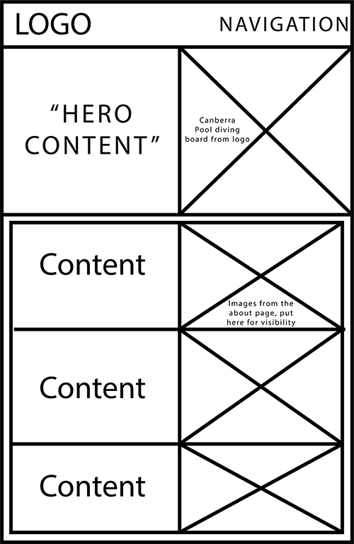
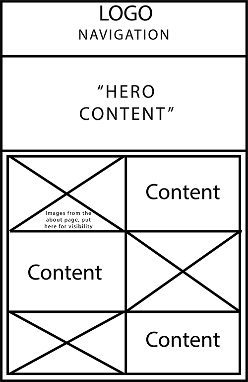
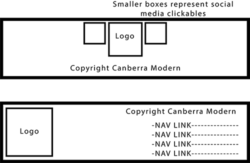

# Michael Karle Front-End Web Design - Project 1

## Reflection
Throughout the process of creating my website, my primary strength was time management and good organisation of my code. I began work soon after getting the assignment brief, in order to be able to experiment with different techniques, and most importantly, have time to make mistakes. I structured my code in a way where I used semantic tags wherever possible, and where not possible I used CSS classes that made sense to the content they styled. Within the CSS document, relevant code is grouped together, so I can edit a section easily and not get confused regarding what code effects what areas of my pages. One mistake I made in my planning was not accounting for the incorporation of a reactive CSS menu. I built my header originally with CSS Grid, which functioned fine, but when trying to implement a reactive CSS menu the grid layout prevented the header from functioning correctly. I tried to remake my header with flexbox, but it ended up breaking my design and I couldn't comprehend the code on my own. If I had integrated the reactive menu from the beginning I could have built my site to account for it, however I did end up creating a subsitution in the form of a menu that appears below a certain screen width, functioning much the same as a drop-down hamburger menu. 

When going through the process of making my site, I would create each element in html and css before moving on to the next section, instead of laying out all my HTML before styling it. I did it this way as it would let me understand how to make each element reactive correctly and in isolation, rather than relying on other elements to move eachother around. I did this both for my own learning, as well as to make sure that when using media queries other elements wouldn't clash with the changes, avoiding a situation where I would have to effectively change everything about an element for it to be reactive. 

## Low-Fi Prototypes
After recieving the brief from the Canberra Modern organisers in class, I quickly discussed my ideas and got help developing a solid structure idea early on, before I had actively ideated. This idea revolved around a central hero image, which served to incorporate the canberra diving board, and iconic part of Canberra Modern's logo, into the website. Otherwise the logo would have been difficult to read or scale reactively, so I decided to seperate the two elements to make them both visually appealing. The central hero image allowed me to also use the Canberra modern motto on my site in a prominent area, which I think is important for communicating the group's attitude to their work. I also decided during my prototyping stage to combine the content of the home and about pages from the original site, so that a reader wouldn't have to click to another page to discover what the group is about.

The idea for the hero image on the index was implemented as planned, however the final layout of my index page and footer differed from what I had planned, though only in minor ways. For example, instead of having all the images to one side on my index, I instead had them alternate between text and images in the final version. The changes were largely cosmetic and for the visual display of the site, however the footer layout was altered to be easier to layout. I found the layouts I planned hard to create with flexbox or grid, so settled on a simpler layout. It still looks good and functions, but differs from my original prototypes. I also decided upon removing the links from the footer, as it made it look cluttered and the header was sticky, so the links were present on the same viewport regardless.

Another element that was added but not planned in my prototypes was a 'back to top' button. I did this after seeing that some pages such as my 'gallery' page would be quite lengthy, so I wanted to provide a feature to allow easier access around the page.

## Helpful Resources

[Back to top button](https://www.freecodecamp.org/news/css-only-back-to-top-button/)
This site helped me understand the code needed to make a back-to-top button, which I later adapted into my own code.
It was excellent for  helping me understand the process, as well as how to make a moving element that could scale reactively with the page size.

[CSS Grid Guide](https://css-tricks.com/snippets/css/complete-guide-grid/)
This site, which was linked on canvas, was awesome for helping me understand how to properly use the grid function. 
I used it as my cheat sheet for grid, as well as my first port of call when I encountered a problem.

[CSS Hamburger](https://heyoka.medium.com/responsive-pure-css-off-canvas-hamburger-menu-aebc8d11d793)
Although I couldn't succesfully integrate a hamburger menu into my site, this resource was still helpful to try and understand the process.
What I learnt is that its best to integrate the menu early into the website's development, so that other code does not conflict with the element. 
 
